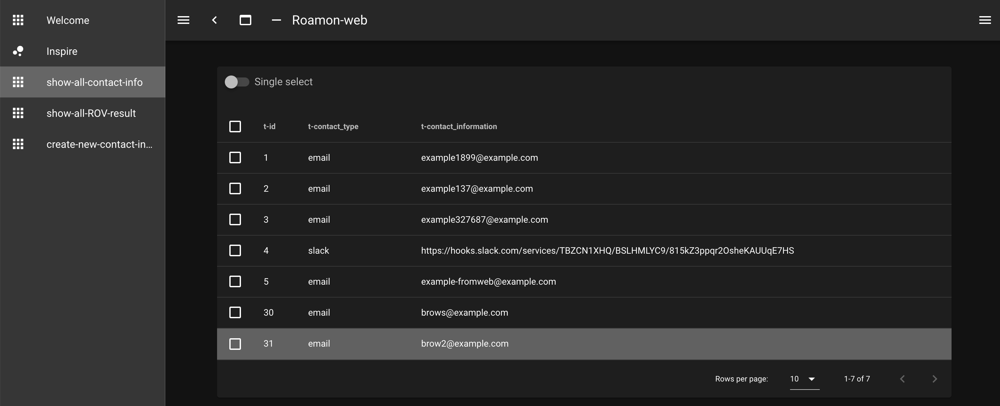

# roamon-web
roamon-alertのWeb GUI的なことができます.  

## Installation
まずクローンします
```bash
$ git clone https://github.com/taiji-k/roamon-web.git
```
### ローカルマシンでyarnで起動
``` bash
$ yarn dev
```
`http://localhost:3000`にアクセス！

### NOTE !
roamon-alertのDBが起動してないと使えません。

roamon-alertの環境を起動するには以下のようにします
これをすればDBが一緒に起動します。
```bash
$ git clone https://github.com/taiji-k/roamon-alert.git
$ cd roamon-alert

$ sudo docker-compose -f ./docker/docker-compose.yml up
```

次にコンテナの中でroamon-alert本体を起動します。こうするとDBの中身が準備されます。  
初回は、データをダウンロードするためroamon-alertのデーモンの起動にちょっと時間かかります。
```bash
$ sudo docker exec -it roamon-alert  /bin/bash
># pipenv install
># pipenv shell
(roamon-alert) ># python3 roamon_alert_controller.py daemon --start
```

## Usage
左上のバーガーメニューから3つの機能が使えます。
* 全ての連絡先の表示
* 全てのROV結果の表示
* 新しい連絡先と監視対象prefix, asnの追加
    * prefixとasnは `,` 区切りで複数指定できます


